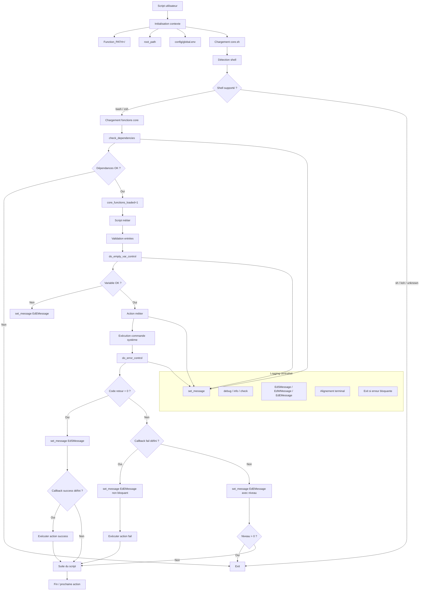
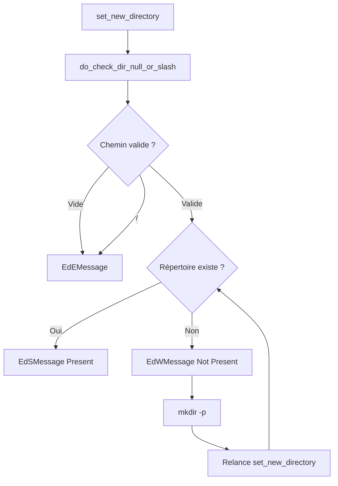
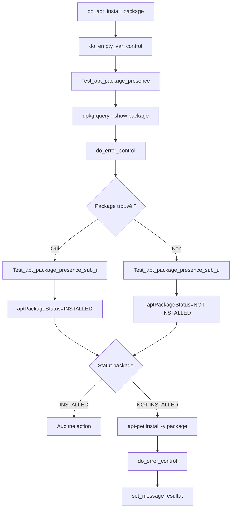

# CAST - CORE

## 📌 Description

**CAST - CORE** est une bibliothèque Shell (Bash) centralisée fournissant un socle standardisé pour :

* la gestion des logs et messages
* le contrôle des erreurs
* la validation des entrées
* la gestion des dépendances système
* les opérations système (filesystem, réseau, packages)
* la structuration des scripts avec stack trace

Elle est conçue pour être utilisée comme **framework de scripting industriel**, orienté :

* automatisation DevSecOps
* conformité (ISO / bonnes pratiques)
* reproductibilité
* lisibilité et maintenance




---

## ⚙️ Fonctionnalités principales

### 🧠 Gestion des messages

* `set_message`
* format standardisé (DEBUG / INFO / CHECK / SUCCESS / WARNING / ERROR)
* gestion des couleurs + alignement dynamique terminal

### 🚨 Gestion des erreurs

* `do_error_control`
* exécution conditionnelle (success / fail hooks)
* contrôle du niveau de criticité
* support des workflows automatisés

### 🔐 Validation des entrées

* `do_empty_var_control`
* contrôle strict des variables
* mode test (non bloquant)
* gestion interne/externe

### 📂 Gestion filesystem



* `set_new_directory`
* `do_check_dir_null_or_slash`
* protection contre erreurs critiques (`/`, vide)

### 🌐 Téléchargement HTTP

* `get_http_object`
* gestion idempotente
* validation post-download

### 📦 Gestion APT




* `do_apt_update`
* `do_apt_install_package`
* `do_apt_uninstall_package`
* `Test_apt_package_presence`

➡️ Gestion intelligente via variable globale :

``` bash
aptPackageStatus = INSTALLED / NOT INSTALLED
```

### 🔄 Modularité

* `do_load_file`
* chargement dynamique de modules

### 📏 Formatage console

* `print_header`
* `set_console_line`
* `set_spacer_message`

---

## 🧱 Architecture

```txt
CAST/
├── lib/
│   └── core.sh
├── bin/
├── config/
├── log/
├── help/
└── do_test_core.sh
```

---

## 🚀 Initialisation

### Chargement de la lib

```bash
source "${root_path}/lib/core.sh"
```

Exemple réel :

---

## 🔍 Détection environnement

La lib valide automatiquement :

* shell utilisé (bash requis)
* dépendances système (`ps`, `tput`, `date`, etc.)

Extrait :

---

## 🧪 Tests

Script de validation fourni :

```bash
./do_test_core.sh
```

Fonctions testées :

* affichage messages
* gestion erreurs
* validation variables
* gestion répertoires

Exemple :

---

## 📐 Conventions de développement

### 🔹 Shell

* Bash uniquement
* variables toujours protégées :

```bash
variable="value"
${variable}
```

### 🔹 Structures

* `if / then` sur lignes séparées
* fonctions déclarées :

```bash
function name()
{
}
```

### 🔹 Logs

* aucun `echo` direct (hors utilitaire)
* utiliser exclusivement :

``` bash
set_message
```

### 🔹 Gestion erreurs

* toujours via :

``` bash
do_error_control
```

---

## 🧩 Pattern clé : orchestration via callbacks

Exemple :

```bash
do_error_control "${?}" "" "0" "1" "" "on_fail" "on_success"
```

➡️ Permet :

* pipeline contrôlé
* comportement dynamique
* suppression du code spaghetti

---

## ⚠️ Limitations

* Bash uniquement (non POSIX)
* dépendance à `tput`
* dépendance APT (Debian-based)
* variables globales utilisées (`aptPackageStatus`, `Function_PATH`)

---

## 🔐 Bonnes pratiques intégrées

* idempotence (install / download)
* validation stricte des entrées
* logs uniformisés
* séparation logique (core vs modules)
* traçabilité (stack trace interne)

---

## 📈 Cas d’usage

* scripts d’installation automatisés
* bootstrap d’infrastructure
* pipelines DevSecOps
* tooling interne sécurisé
* POC industrialisés

---

## 🧠 Philosophie

> "Un script doit être :
>
> * prédictible
> * traçable
> * maintenable
> * sûr"

---

## 📎 Auteur / contexte

Projet orienté :

* architecture cloud
* automatisation sécurisée
* conformité (ISO / SecNumCloud)

---

## 🔚 Statut

🟢 Stable (core fonctionnel)
🟡 Évolutif (modules à étendre)

---
